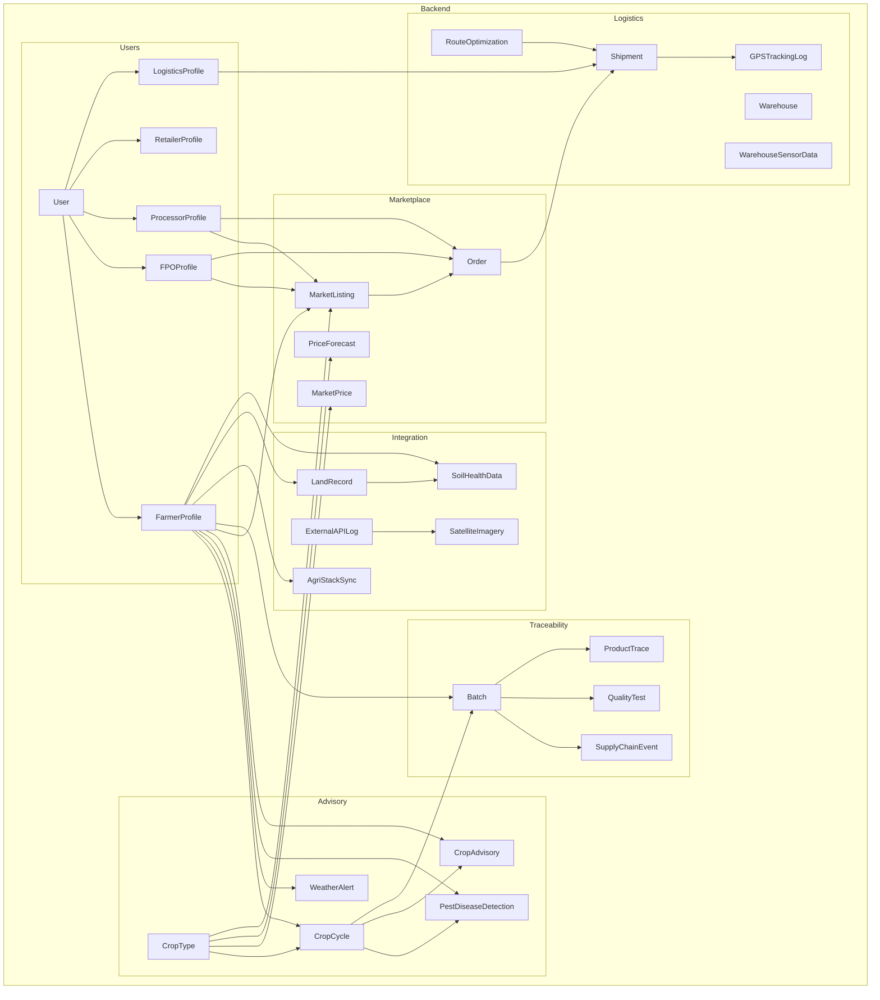

    

    <b>Automatic Architecture Diagrams from Code</b> 
    <a href="https://github.com/swark-io/swark">GitHub</a> • <a href="https://swark.io">Website</a> • <a href="mailto:contact@swark.io">Contact Us</a>

## Usage Instructions

1. **Render the Diagram**: Use the links below to open it in Mermaid Live Editor, or install the [Mermaid Support](https://marketplace.visualstudio.com/items?itemName=bierner.markdown-mermaid) extension.
2. **Recommended Model**: If available for you, use `claude-3.5-sonnet` [language model](vscode://settings/swark.languageModel). It can process more files and generates better diagrams.
3. **Iterate for Best Results**: Language models are non-deterministic. Generate the diagram multiple times and choose the best result.

## Generated Content
**Model**: GPT-4o - [Change Model](vscode://settings/swark.languageModel)  
**Mermaid Live Editor**: [View](https://mermaid.live/view#pako:eNqFVclu2zAQ_RVDQG7JQYtz8KGA1taAi7iRixzoHibUxCIiiQJJBXWD_HupzQFpG9GJb94sb4Yj6d2hvEBn5eybg4C2XOySfbPQj-yeR0ME9BWbYrQazG-JQn7a-yd0SW_9Y1k9koGoUWwFf2EV2rRPsu3DFS4gmqAoJb8WvSSPqEAT1xzuyYYfmFSMynOPy62FxRvTFY9mpsglseDt7tjaNSJvYOIjPSsf-eQJQZUoQi1R2azuD6VKmESQmKBCqhhvbK_lkH5W9aX8nyBeUbUVUDQTxS4Zua1g1FYae2QwZ1wgBWlLjf0pdtPPsjnYdEAeRGHc_WVxO6FlwTOrmLLmm7gkAkVLK3Pikbxr2-oYl8Ca9A0bW1rik18d9Al3eKY7GVao6KgaKn-p77QsZprUJU8gsOSdtAeXep9Ujo2-ogQU2E4-yUvW1ufq04B83-a9uFc9Vl3e5vWG807hQ6tYzf6BtSCXu1g3CvWp9zWzZS4JD4LlSpfLjw21imUe2UBTPCLlorA53QJn1Q-ESpUXWswCkv5VKBqowu36vJFsSXJQWOmLwnUNB7y8ysNhPN7cLB6xGrqQenjTlYTu4u7um_6smNA3YWDCpQnv5xKhNxgiz4S-CQMTLufoyDWiI9M9uuIeuyb0TOhb2uJZjG_CwHKPJz4w-cCMDk7uI5_O6e5PcDSkY0A6xadLi5_UJa7R7AyTsZnEM6FvwsBKlrkmNG8lm6IzC46NZHrMzq2j_zM1sEL_0973jv7u1rh3Vou9U-ALdJXaOx_aqWsLvYkJA_2O1M5KiQ5vHegU71-JGQveHUpn9QKVxI__mA_kUA) | [Edit](https://mermaid.live/edit#pako:eNqFVclu2zAQ_RVDQG7JQYtz8KGA1taAi7iRixzoHibUxCIiiQJJBXWD_HupzQFpG9GJb94sb4Yj6d2hvEBn5eybg4C2XOySfbPQj-yeR0ME9BWbYrQazG-JQn7a-yd0SW_9Y1k9koGoUWwFf2EV2rRPsu3DFS4gmqAoJb8WvSSPqEAT1xzuyYYfmFSMynOPy62FxRvTFY9mpsglseDt7tjaNSJvYOIjPSsf-eQJQZUoQi1R2azuD6VKmESQmKBCqhhvbK_lkH5W9aX8nyBeUbUVUDQTxS4Zua1g1FYae2QwZ1wgBWlLjf0pdtPPsjnYdEAeRGHc_WVxO6FlwTOrmLLmm7gkAkVLK3Pikbxr2-oYl8Ca9A0bW1rik18d9Al3eKY7GVao6KgaKn-p77QsZprUJU8gsOSdtAeXep9Ujo2-ogQU2E4-yUvW1ufq04B83-a9uFc9Vl3e5vWG807hQ6tYzf6BtSCXu1g3CvWp9zWzZS4JD4LlSpfLjw21imUe2UBTPCLlorA53QJn1Q-ESpUXWswCkv5VKBqowu36vJFsSXJQWOmLwnUNB7y8ysNhPN7cLB6xGrqQenjTlYTu4u7um_6smNA3YWDCpQnv5xKhNxgiz4S-CQMTLufoyDWiI9M9uuIeuyb0TOhb2uJZjG_CwHKPJz4w-cCMDk7uI5_O6e5PcDSkY0A6xadLi5_UJa7R7AyTsZnEM6FvwsBKlrkmNG8lm6IzC46NZHrMzq2j_zM1sEL_0973jv7u1rh3Vou9U-ALdJXaOx_aqWsLvYkJA_2O1M5KiQ5vHegU71-JGQveHUpn9QKVxI__mA_kUA)

